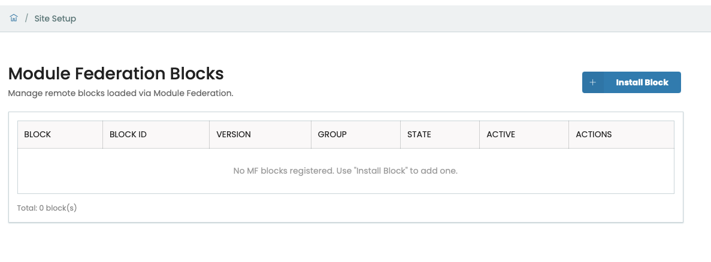
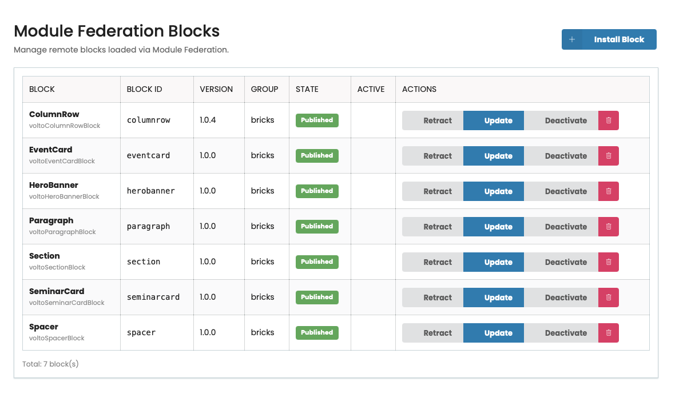

# MF-Blocks-Manager

> **[Leer en Español](README.es.md)**

Dynamic block loading for Plone 6 / Volto using Webpack Module Federation. Install, activate, and remove Volto blocks at runtime — no frontend rebuild required.

## Quick Install

```bash
# Default — auto-detects your Plone project:
curl -sL https://raw.githubusercontent.com/RenteriaMX/MF-Blocks-Manager/main/install.sh | bash

# Or with a specific project path:
curl -sL https://raw.githubusercontent.com/RenteriaMX/MF-Blocks-Manager/main/install.sh | bash -s /opt/plone/mi-proyecto
```

No `sudo` required. Run as the Plone system user. The script auto-detects your Plone project, installs backend + frontend + Nginx config, builds, restarts services, and activates the add-on.

## What It Does

Traditional Volto requires a full frontend rebuild to add a new block (5-10 min compile + deploy + restart). With MF-Blocks-Manager:

1. Build your block as a standalone webpack package
2. Upload the `.tar.gz` from **Site Setup → Module Federation Blocks**
3. The page auto-reloads and the block is immediately available in the editor under the **Bricks** group

No rebuild. No restart. No deploy pipeline.

## Architecture

```
┌─────────────────────────────────────────────────┐
│                Plone Backend                     │
│  collective.mfblocks                             │
│  ├── Content Type: MFBlock                       │
│  │   (upload .tar.gz, auto-extract, publish)     │
│  ├── GET @blocks-registry (public)               │
│  └── GET/PATCH/POST @mfblocks-manage (admin)     │
└───────────────────┬─────────────────────────────┘
                    │ REST API
┌───────────────────▼─────────────────────────────┐
│                Volto Frontend                    │
│  volto-mfblocks                                  │
│  ├── Block registry (same-origin endpoint + SSR) │
│  ├── MF Loader (shared React/ReactDOM scope)     │
│  ├── View/Edit wrappers (host manages sidebar)   │
│  └── Control Panel UI (Site Setup)               │
└───────────────────┬─────────────────────────────┘
                    │ HTTP
┌───────────────────▼─────────────────────────────┐
│                   Nginx                          │
│  /mf-blocks/{block_id}/remoteEntry.js            │
└─────────────────────────────────────────────────┘
```

## What Gets Installed

| Component | Description |
|---|---|
| **Backend** (`collective.mfblocks`) | Content Type MFBlock, `@blocks-registry` endpoint (public), `@mfblocks-manage` endpoint (admin), event subscribers for bundle extraction |
| **Frontend** (`volto-mfblocks`) | MF Loader with shared scope, SSR pre-registration, View/Edit wrappers with host-side sidebar, Control Panel in Site Setup |
| **Nginx** | Static file serving at `/mf-blocks/` with CORS headers |

## Auto-Installer Features

The `install.sh` script automatically:

- Detects Plone project directory (or lets you choose if multiple found)
- Detects current user (`whoami`), systemd `--user` services (pattern `plone-*-backend` / `plone-*-frontend`), pip tool (`uv` / `pip`)
- Installs backend Python package
- Copies frontend addon and registers it in `volto.config.js` and `package.json`
- Runs `pnpm install` and builds the frontend
- Creates `<project>/var/mf-blocks` directory for block bundles
- Configures Nginx location block (uses `sudo` only for `nginx -t` and `systemctl reload nginx`)
- Activates the add-on via `zconsole` (fallback: `uv run zconsole`)
- Restarts all services via `systemctl --user`

> **Nginx note:** The installer calls `sudo /usr/sbin/nginx -t`, `sudo /usr/bin/systemctl reload nginx` and `sudo <setfacl-path>` (to grant the Nginx worker user traversal access to `$HOME` without opening it to everyone else). It resolves `setfacl`'s absolute path itself (via `command -v setfacl`) so the `sudo` call matches a `sudoers` rule by exact path — run `command -v setfacl` on your server to find that path (commonly `/usr/bin/setfacl` on Debian/Ubuntu, sometimes `/usr/sbin/setfacl` elsewhere) and add a rule like:
>
> ```
> plone ALL=(ALL) NOPASSWD: /usr/sbin/nginx -t, /usr/bin/systemctl reload nginx, /usr/bin/setfacl
> ```
>
> Without `NOPASSWD` for `setfacl`, the installer will print the exact command to run manually (it won't abort the rest of the install).

## Control Panel

After installation, go to **Site Setup → Module Federation Blocks**:






- View all installed blocks with name, block ID, version, group, status
- **+ Install Block** — upload a `.tar.gz` bundle with metadata
- Publish / Retract / Activate / Deactivate / Delete blocks
- Block ID and Remote Name auto-generated from title
- **Auto-reload** — the page reloads automatically after install/publish/retract/delete so the block appears immediately in the editor
- MF blocks appear under a dedicated **Bricks** group in the block chooser (separate from native Volto blocks)

## The Three Rules

### Rule #1: The Golden Rule
Blocks ONLY depend on React. **NEVER** import Volto components (`SidebarPortal`, `BlockDataForm`, `@plone/volto/helpers`, etc.). The host handles the sidebar using the exported schema.

### Rule #2: Shared Scope
The host provides React and ReactDOM to remote blocks via Module Federation shared scope. Without this, blocks create duplicate React instances and hooks crash.

### Rule #3: SSR Pre-Registration
On the server (Node.js), blocks are pre-registered synchronously at startup via `@blocks-registry`. Without this, anonymous visitors see "Unknown Block".

## Creating a Block

### Block Structure

```
my-block/
├── package.json
├── webpack.config.js
└── src/
    ├── index.js      ← export { view, edit, schema }
    ├── View.jsx       ← React component (view mode)
    ├── Edit.jsx       ← React component (edit preview only)
    └── Schema.js      ← Schema object for BlockDataForm
```

### Export Contract (`src/index.js`)

```js
import View from './View';
import Edit from './Edit';
import schema from './Schema';

export default { view: View, edit: Edit, schema };
```

- `view` — React component rendered in view mode
- `edit` — React component rendered as preview in edit mode (NOT the sidebar)
- `schema` — Schema object. The HOST renders `SidebarPortal` + `BlockDataForm` using this schema

### Props the host injects

On top of the standard Volto block props, the loader passes two extra props to
your block's `view` and `edit` components so it can call protected backend
endpoints:

- `authToken` — the logged-in user's JWT (or `null` for anonymous visitors).
- `apiPath` — the Plone backend base URL (useful in headless setups where the
  API is on a different origin than the frontend).

```js
const View = ({ data, authToken, apiPath }) => {
  const headers = authToken ? { Authorization: `Bearer ${authToken}` } : {};
  // fetch(`${apiPath}/@my-protected-endpoint`, { headers })
  // ...
};
```

Both are additive and optional — blocks that don't need them just ignore them.
Note that an MF block is third-party JavaScript running same-origin in the
page, so it could already reach the Redux store, cookies and localStorage on
its own; `authToken` is a convenience for legitimate blocks, not a new
privilege.

### Schema Example (`src/Schema.js`)

```js
const schema = {
  title: 'My Block',
  fieldsets: [
    { id: 'default', title: 'Default', fields: ['myField'] },
  ],
  properties: {
    myField: {
      title: 'My Field',
      type: 'string',
    },
  },
  required: [],
};

export default schema;
```

### webpack.config.js

```js
const base = require('../../shared/webpack.base');

module.exports = base({
  name: 'voltoMyBlockBlock',    // Remote Name
  entry: './src/index.js',
  exposes: {
    './block': './src/index.js', // Remote Module
  },
});
```

### Build and Package

```bash
cd blocks/my-block
npx webpack --mode production
tar -czf my-block.tar.gz -C dist .
```

The shared `webpack.base` automatically emits an `mf-manifest.json` into the
bundle — the explicit contract the backend reads on install to auto-detect the
exposed module and version:

```json
{ "name": "voltoMyBlockBlock", "module": "./block", "version": "1.0.0" }
```

If you build your bundle without `webpack.base`, include this file in the
tarball root yourself. Bundles without a manifest still work: the backend
falls back to parsing `remoteEntry.js`, but that parsing depends on the
exact webpack/terser output format and may fail silently on other versions.

### Install

**Site Setup → Module Federation Blocks → + Install Block** → Upload `.tar.gz` → Done.

## Manual Installation (without script)

### 1. Backend

```bash
cd /opt/plone/<project>/backend
git clone https://github.com/RenteriaMX/MF-Blocks-Manager.git /tmp/MF-Blocks-Manager
cp -r /tmp/MF-Blocks-Manager/backend/collective.mfblocks packages/
pip install -e packages/collective.mfblocks
systemctl --user restart plone-backend-1
# Site Setup → Add-ons → Install collective.mfblocks
```

### 2. Frontend

```bash
cd /opt/plone/<project>/frontend
cp -r /tmp/MF-Blocks-Manager/frontend/volto-mfblocks packages/
# Add 'volto-mfblocks' to volto.config.js addons array
# Add "volto-mfblocks": "workspace:*" to package.json dependencies
pnpm install
VOLTOCONFIG=$(pwd)/volto.config.js pnpm --filter @plone/volto build
systemctl --user restart plone-volto
```

### 3. Nginx

```nginx
location /mf-blocks/ {
    alias /opt/plone/<project>/var/mf-blocks/;
    expires 1h;
    add_header Access-Control-Allow-Origin *;
}
```

```bash
mkdir -p /opt/plone/<project>/var/mf-blocks
sudo /usr/sbin/nginx -t && sudo /usr/bin/systemctl reload nginx
```

## Repository Structure

```
MF-Blocks-Manager/
├── install.sh                                    ← Auto-installer
├── README.md                                     ← This file (English)
├── README.es.md                                  ← Spanish version
├── backend/
│   └── collective.mfblocks/                      ← Plone add-on
│       ├── pyproject.toml
│       └── src/collective/mfblocks/
│           ├── content/mfblock.py                ← Content Type IMFBlock
│           ├── services/blocks_registry.py       ← GET @blocks-registry
│           ├── services/mfblocks_manage.py       ← GET/PATCH/POST @mfblocks-manage
│           └── subscribers/mfblock.py            ← Extract/remove bundle events
└── frontend/
    └── volto-mfblocks/                           ← Volto addon
        ├── package.json
        └── src/
            ├── index.ts                          ← applyConfig (sync registration)
            ├── mf/loader.ts                      ← loadRemoteModule + shared scope
            ├── mf/MFBlocksLoader.tsx             ← View/Edit wrappers
            ├── mf/ssrPreRegister.ts              ← SSR pre-registration
            └── components/MFBlocksControlPanel/  ← Control Panel UI
```

## Requirements

- Plone 6.1+ with Volto
- Python 3.10+
- Node.js 18+
- pnpm 9+
- Nginx
- git, curl

## Known Limitations

- **MF block content is not server-rendered.** SSR pre-registration only
  prevents the "Unknown Block" error for anonymous visitors; the actual block
  content renders client-side after hydration. If SEO or no-JS rendering of MF
  block content matters to you, use natively built Volto blocks for that
  content.
- **Single-host deployment is assumed.** Bundles are extracted to the local
  filesystem (`var/mf-blocks/`) of the backend instance that handles the
  upload. Multi-machine ZEO clusters would need a shared filesystem or object
  storage for that directory.
- **Trust boundary:** anyone with the `cmf.ManagePortal` permission (Site
  Administrators) can upload bundles, which means they can run arbitrary
  JavaScript in every visitor's browser. This is the feature working as
  designed — grant that permission accordingly.
- The SSR server needs `curl` available in its PATH for the one-time
  synchronous registry fetch at startup (already listed in Requirements).

## Troubleshooting

| Problem | Cause | Solution |
|---|---|---|
| "Unknown Block" in public view | SSR doesn't have blocks registered | Restart `plone-volto` |
| Block not in editor chooser | MFBlock not published or not active | Check in MF Blocks Manager, reload page |
| Block appears in Common instead of Bricks | Block was installed with old `group: "common"` | Delete and reinstall the block |
| `null is not an object (useState)` | Dual React instances | Verify shared scope includes host React |
| Empty sidebar when editing | Block imports SidebarPortal from Volto | Apply Golden Rule: block only exports schema |
| Build doesn't include addons | Missing `VOLTOCONFIG` | Use `VOLTOCONFIG=$(pwd)/volto.config.js` |
| `icon: null` crash in block chooser | Icon is null in blocksConfig | Uses `codeSVG` from `@plone/volto/icons/code.svg` |

## Author

- **Juan Renteria** — juan.renteria@it4s.mx

## Contributors

- **Julia Bernuy S.** — bernuy@unam.mx

## License

MIT
